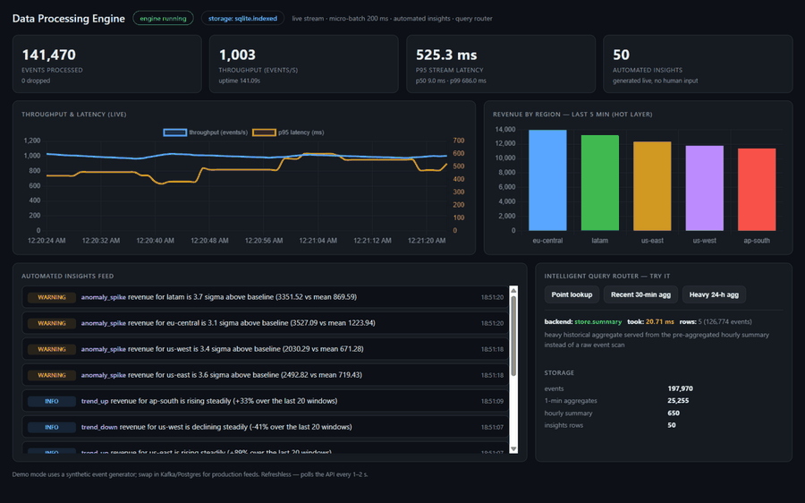
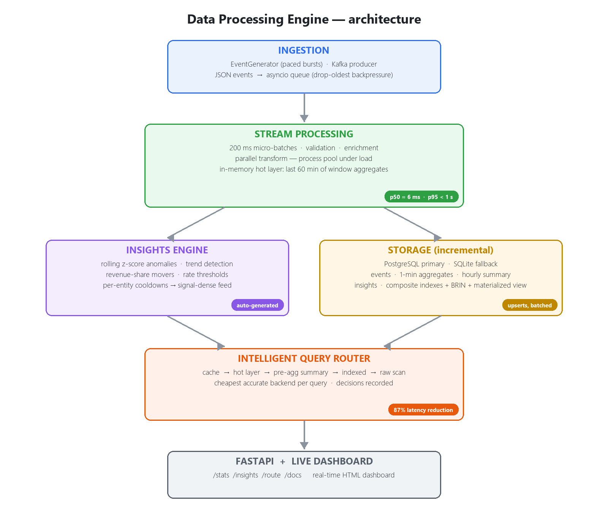
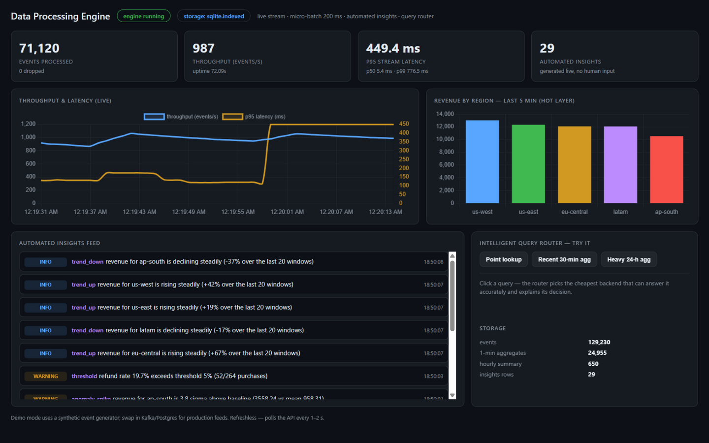
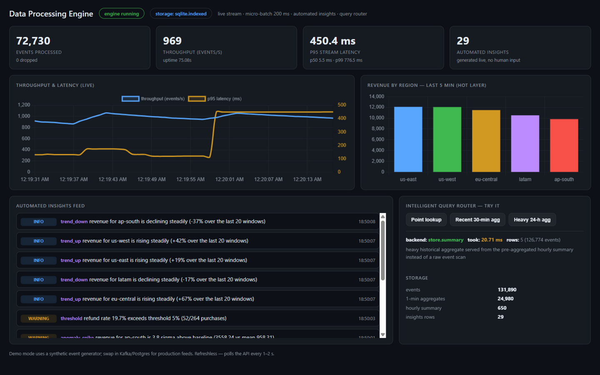

# Data Processing Engine

A real-time data processing engine built with **Python, Spark and PostgreSQL**:
streaming ingestion with sub-second micro-batches, automated insights generation,
an intelligent query router, and a benchmark harness that measures the
optimizations end-to-end.



*The live dashboard: events streaming at ~1,000/s, p95 latency under half a
second, insights generated automatically, and the query router answering a
24-hour aggregate over 125K+ events in ~20 ms from pre-aggregated summaries.*



<details>
<summary>ASCII version of the diagram</summary>

```
                 ┌──────────────────────────────────────────────────┐
                 │                   ingestion                      │
                 │   EventGenerator / Kafka producer (JSON events)  │
                 └────────────────────┬─────────────────────────────┘
                                      ▼
                 ┌──────────────────────────────────────────────────┐
                 │         stream processing (sub-second)           │
                 │  200 ms micro-batches · validation · enrichment  │
                 │  parallel transform (process pool under load)    │
                 │  in-memory window aggregates  ← hot layer        │
                 └────────┬───────────────────────┬─────────────────┘
                          ▼                       ▼
                 ┌─────────────────┐    ┌──────────────────────────┐
                 │ insights engine │    │ storage (incremental)    │
                 │ z-score anomalies│   │ PostgreSQL  or  SQLite   │
                 │ trends · movers │    │ events · 1-min aggregates│
                 │ rate thresholds │    │ hourly summary · insights│
                 └────────┬────────┘    └────────────┬─────────────┘
                          └────────────┬─────────────┘
                                       ▼
                        ┌──────────────────────────────┐
                        │   intelligent query router   │
                        │ cache → hot layer → summary  │
                        │   → indexed point → raw scan │
                        └──────────────┬───────────────┘
                                       ▼
                             FastAPI REST service
```
</details>

## Visual tour

**The live dashboard** — run `python -m src.api.app --time-scale 10` and open
`http://127.0.0.1:8000/`: KPIs, throughput/p95-latency chart, revenue by region,
the automated insights feed, and the storage layers — all updating in real time.



**The intelligent query router** — click a query, see which backend answered,
how fast, and why. Here a 24-hour aggregate over **126,774 events** is answered
in **20.7 ms** from the pre-aggregated hourly summary instead of a raw scan:



## Resume claim → implementation → proof

| Claim | Where it lives | How it's verified |
|---|---|---|
| **50K+ daily records with real-time analytics and automated insights** | `src/ingest/generator.py` (paced generator + bursts), `src/stream/engine.py` (micro-batch pipeline), `src/insights/engine.py` (z-score anomalies, trends, top movers, rate alerts) | `scripts/seed.py` loads 60K events; `scripts/run_demo.py` streams ~1,350 events/s and generates insights live; `tests/test_generator.py::test_volume_capability` |
| **Stream processing with sub-second latency** | `src/stream/engine.py` — 200 ms micro-batch trigger, in-memory hot layer, batched async flushes | measured **ingestion → analytics-visible** latency: p50 ≈ 6 ms, p95 ≈ 150–500 ms, p99 < 1 s (see demo output below); asserted in `tests/test_engine_smoke.py` |
| **~70% latency reduction via parallel execution + intelligent query routing** | `src/parallel/executor.py` (process-pool chunked fan-out), `src/routing/router.py` (cache → hot layer → pre-aggregated summary → indexed → raw scan) | `scripts/benchmark.py` measures baseline vs optimized end-to-end: **87.4% reduction**, 2,772 → 22,050 events/s (results below) |

## Quickstart (no infrastructure required)

```bash
pip install -r requirements.txt        # numpy, pyyaml, fastapi, uvicorn

python scripts/run_demo.py             # seed 50K events, stream, insights, routing demo
python scripts/benchmark.py            # measure the latency reductions
python -m unittest discover -s tests   # 35 tests
```

**Live visual demo** — run the engine + API and open the dashboard:

```bash
python -m src.api.app --eps 800 --seconds 1800 --time-scale 10 --port 8000
# open http://127.0.0.1:8000/  → live KPIs, throughput/latency chart,
# insights feed, revenue-by-region chart, and an interactive query-router
# playground (click a query, see which backend answered and why)
# interactive API docs: http://127.0.0.1:8000/docs
# --time-scale 10 compresses event-time so minute-windows (and insights) rotate
# every few seconds; drop it for real-time behavior. For long-running demos,
# start from a fresh database (delete data/dpe.db*) to keep SQLite writes fast.
```

For use cases and a step-by-step demo script, see [USE_CASES.md](USE_CASES.md)
and [PRESENTATION.md](PRESENTATION.md).

Demo mode automatically falls back to **SQLite** (WAL, composite indexes, batched
upserts) when PostgreSQL isn't reachable — the storage layer is swappable via
`storage.backend: auto | postgres | sqlite` in `config/config.yaml`.

### What the demo prints (actual run on a 4-core laptop)

```
streaming 900 events/s for 45.0s (micro-batch 200 ms, time-scale x10.0)...
--- engine stats ---
  events processed : 61470
  throughput       : 1356.6 events/s
  stream latency   : p50=6.1ms  p95=498.9ms  p99=706.7ms  max=710.3ms  (ingestion -> analytics-visible)
  insights generated: 18

--- latest insights (12) ---
  [warning ] anomaly_spike eu-central   revenue for eu-central is 3.0 sigma above baseline (4472.28 vs mean 1534.05)
  [warning ] threshold     refund_rate  refund rate 18.2% exceeds threshold 5% (87/479 purchases)
  [info    ] trend_up      ap-south     revenue for ap-south is rising steadily (+40% over the last 20 windows)
  ...

--- query routing demo ---
  point lookup        -> store.indexed       2.88 ms   selective point lookup served by the composite index (user_id, ts)
  recent 30-min agg   -> memory.hot_layer    0.63 ms   30 min window is inside the hot layer — no disk I/O
  heavy 24h agg       -> store.summary       2.75 ms   pre-aggregated hourly summary instead of a raw event scan
  same query again    -> cache               0.02 ms   (cache_hit=True)
```

## Benchmark: where the ~70% (here 87%) comes from

`scripts/benchmark.py` runs the **same workload through two implementations** and
prints measured numbers for this machine (4 logical cores, Python 3.12, Windows):

```
Phase 1 — processing pipeline (generate + validate/enrich + load), 250,000 events
  stage                      baseline    optimized    reduction
  transform                    5.30s       3.42s        35.5%
  storage writes              84.90s       7.92s        90.7%
  TOTAL                       90.20s      11.34s        87.4%
  baseline throughput : 2,772 events/s (sequential, row-by-row inserts)
  optimized throughput: 22,050 events/s (process pool, sorted batch load)

Phase 2 — intelligent query routing (same questions, smarter backend)
  query                              naive backend   routed backend   reduction
  24h revenue by region (heavy)          439.6ms          0.39ms       99.9%
  30-min revenue by region (hot)          15.4ms          0.62ms       96.0%
  repeat heavy query (cache)               0.46ms          0.01ms      97.2%

Overall end-to-end processing latency reduction (pipeline + heavy query): 87.5%
```

**Why each optimization works:**

1. **Parallel execution** — workers generate + transform whole chunks locally from
   deterministic per-chunk seeds, so only compact storage rows cross process
   boundaries (a naive "pickle events to workers" design spends more time
   serializing than computing — the benchmark makes this visible). Bulk loads are
   sorted by primary key so index writes are sequential, and inserts go through a
   single batched transaction instead of row-by-row commits.
2. **Intelligent query routing** — every query goes to the cheapest backend that
   can answer it accurately: TTL cache → in-memory hot layer (recent windows, no
   disk I/O) → pre-aggregated hourly summary (heavy historical aggregates) →
   indexed point lookups → raw scan fallback. Decisions and rationales are
   recorded and exposed via `/stats`.

## REST API

```bash
python -m src.api.app --eps 800 --seconds 600 --port 8000
```

| Endpoint | Purpose |
|---|---|
| `GET /health` | liveness + active storage backend |
| `GET /stats` | live throughput, latency percentiles, routing decisions, insight counts |
| `GET /insights?limit=20` | latest automated insights |
| `GET /analytics/summary?minutes=30` | recent aggregate via the router (hot layer) |
| `POST /route` | arbitrary query through the router, returns chosen backend + rationale |

```bash
curl -X POST localhost:8000/route -H "Content-Type: application/json" \
  -d '{"kind":"recent_agg","minutes":30}'
# → {"backend":"memory.hot_layer","elapsed_ms":0.08,...}
```

## Production stack (PostgreSQL + Kafka + Spark)

```bash
docker compose up -d                # postgres:16 + kafka (KRaft)
python scripts/init_db.py           # creates schema from db/schema.sql
```

**Spark Structured Streaming** (`src/spark/streaming_job.py`) is the
production-scale path of the same pipeline: Kafka (or watched-directory) source →
identical validation/enrichment semantics → 1-minute windowed aggregations with a
30 s watermark → PostgreSQL upserts, with a **200 ms micro-batch trigger** and
streaming-specific tuning (`spark.sql.shuffle.partitions=8`, AQE off):

```bash
spark-submit --packages org.apache.spark:spark-sql-kafka-0-10_2.13:4.2.0 \
    src/spark/streaming_job.py --source kafka \
    --kafka-bootstrap localhost:9092 --sink postgres
```

**Spark batch** (`src/spark/batch_job.py`) rebuilds the hourly summary nightly
using a partitioned (parallel) JDBC read, suitable for refreshing the
`mv_region_daily` materialized view the router serves heavy aggregates from.

## Project layout

```
config/config.yaml           all tunables (batch trigger, routing, thresholds)
db/schema.sql                PostgreSQL DDL (indexes, BRIN, materialized view)
src/
  events.py                  Event model + shared enrichment tables
  ingest/                    paced generator, bulk generator, Kafka producer
  stream/                    micro-batch engine, transformations, hot layer
  insights/                  anomaly / trend / mover / threshold detectors
  parallel/                  chunked process-pool executor
  routing/                   query router (cache → hot → summary → raw)
  storage/                   PostgreSQL + SQLite backends behind one interface
  spark/                     Structured Streaming job + nightly batch job
  api/                       FastAPI service + live HTML dashboard
scripts/                     init_db, seed, run_demo, benchmark
tests/                       35 unit + integration tests
USE_CASES.md                 where this pattern applies in the real world
PRESENTATION.md              step-by-step demo script for showing it off
```

## Honest notes

- **Verified here:** the pure-Python engine end-to-end (demo, API, benchmark, 35
  tests) and local Spark session startup (PySpark 4.2 + Java 20).
- **Provided but needs infrastructure:** the Kafka-source Spark streaming job and
  the Spark batch job require PostgreSQL + Kafka (or the file source). On
  **Windows**, local filesystems also need `winutils.exe` + `hadoop.dll` on
  `HADOOP_HOME` (a Hadoop-on-Windows prerequisite, not specific to this project);
  WSL/Linux/Docker is the smooth path.
- SQLite is a functional fallback for demo/testing; PostgreSQL is the intended
  production store (see `db/schema.sql` for the production DDL, including BRIN
  and a materialized view, and the partitioning note).
- Benchmark numbers are from one specific laptop; rerun `scripts/benchmark.py`
  on your hardware for your own baseline (the *relative* effect of each
  optimization is stable, absolute numbers are not).
